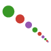

# RationalFunctionApproximation.jl

[](https://complexvariables.github.io/RationalFunctionApproximation.jl/stable/)
[](https://complexvariables.github.io/RationalFunctionApproximation.jl/dev/)
[](https://doi.org/10.5281/zenodo.8355790)
[](https://codecov.io/gh/complexvariables/RationalFunctionApproximation.jl)

[](https://doi.org/10.21105/jcon.00208)



This Julia package adaptively computes rational approximations (i.e., ratios of polynomials) for functions on intervals and other domains in the complex plane.

The [documentation](https://complexvariables.github.io/RationalFunctionApproximation.jl/stable/) includes a walkthrough showing off the main capabilities of the package.

## Quadratic Thiele approximation

This checkout starts from the official `v0.4.1` tag, commit
`abdc2c0b4c690898cdd5c9114b1dced969b4d621`. The QTCF algorithm is
[`src/Quadratic_Thiele.jl`](src/Quadratic_Thiele.jl).

QTCF uses the current positional method selector:

```julia
r = approximate(f, domain, QTCF(); allowed=:strict)
status(r)
isconverged(r)
```

As in TCF, `allowed=true` skips pole checks, and `allowed=p -> ...`
supplies a pole predicate. With `allowed=:strict`, poles must be off a
curve or outside a region, depending on the domain passed in. QTCF checks
all computed poles before reporting convergence. On unsuccessful stopping,
it selects the lowest-error acceptable assessed history entry using the
package's shared selector; if none is acceptable, the selector falls back
to the last assessed entry without reporting convergence. Trial
approximants may contain disallowed poles. QTCF's `status(r).iterations`
counts constructed blocks, including stages omitted from its recorded
history.

QTCF assigns a nonfinite residual an infinite error estimate and excludes
that candidate from residual ranking, including when linearized residuals
are requested. Finite candidates remain eligible. A reflection that fixes
every point uses QTCF singleton blocks, so the same residual policy applies.

A new QTCF block requires finite target values, finite final reduced values,
and finite stored denominator coefficients. Singleton infinite values,
two-infinity pairs, mixed finite/infinite pairs, and NaN values are rejected.
Greedy construction tries another candidate block; direct `add_node!`
rejects the update before modifying the interpolant. Intermediate projective
infinities are permitted during reduction when the final reduced value is
finite. Zero coefficients remain admissible. No previous-node attainment
audit or per-node cancellation diagnostic is performed.

QTCF uses the same public operation names as TCF: `nodes`, `values`,
`weights`, `degrees`, `degree`, `copy`, `isreal`, `evaluate`, `derivative`,
`poles`, `roots`, and `residues`. Numeric conversion and scalar arithmetic
also return QTCF objects. The `.values` and `.weights` properties are
available; QTCF weights are coefficient vectors for denominator blocks.

```julia
g = get_function(r)
evaluate(g, z, Classic())
evaluate(g, points, OneDiv())
RFA.evaluate!(output, g, points)
RFA.evaluate!(output, g, points, numerator_scratch, denominator_scratch)
derivative(g, [0, 1, 2])(z)
convert(BigFloat, g)
```

Array evaluation preserves the input shape. Output and scratch arrays must
have matching axes; scratch arrays must not overlap. `set_eval_method`
controls QTCF's default scalar and array evaluator. The derivative recovery
reuses one denominator reciprocal for the value and all requested orders.
Backward value and derivative recurrences use power-of-two rescaling to
control their common magnitude without additional divisions. A zero
OneDiv denominator triggers Classic evaluation; this is not an
attainability check. Pole extraction returns roots of the unreduced
denominator. Partial-fraction conversion assumes simple poles and rejects
exactly repeated computed poles; the contour residue fallback returns only
the residue at a multiple pole, not its full principal part.

Direct construction follows the supplied node order. `QTCF(z, y)` uses
singleton blocks. Use `block_sizes` to prescribe consecutive pairs or
mixed blocks, and supply it when rebuilding paired weights:

```julia
g = QTCF(z, y; block_sizes=[2, 1, 2])
h = QTCF(nodes(g), values(g), weights(g); block_sizes=[2, 1, 2])
RFA.add_node!(g, z_new, y_new)
RFA.add_node!(g, [z1, z2], [y1, y2], Classic())
```

`add_node!` returns the updated object and accepts one node or a two-node
block. `set_weight_method` controls the default method for these direct
updates and direct construction. Existing greedy approximation retains
its block-reduction implementation. `QTCF{Float32}(z, y)` and
`convert(Float32, g)` provide typed construction and conversion.

Both sampled and continuum `approximate` calls accept `float_type` for
coefficient storage. Sampled symmetric inputs may use
`approximate(y, Symmetric(z; reflection=conj), QTCF())`. Approximation
results share `get_function`, `domain`, `status`, `isconverged`,
`test_points`, `check`, `get_history`, and `rewind` with TCF. Rewinding
preserves the original iteration count and updates the selected history
index and, for sampled data, the test-point mask.

QTCF counts iterations in blocks; TCF counts individual node updates.
QTCF keeps its block-specific refinement, symmetry, and selection options.
The shared `max_degree`, `max_iter`, `tol`, `allowed`, `refinement`, and
`stagnation` keyword names follow the package interface, with budgets
interpreted for each representation.

[`test/qtcf_test.jl`](test/qtcf_test.jl) runs only the experiments in Section 6
of *Greedy quadratic Thiele approximation*: two absolute-value interval
comparisons and eight Schwarz-function curves, producing Figures 6.1–6.3.
From the package directory, with Julia 1.11 or later, run:

```sh
julia --project=test -e 'using Pkg; Pkg.instantiate()'
julia --project=test test/qtcf_test.jl
```

The full paper settings are built into the runner. Its output is saved in
`test/qtcf_output/figures/` (three figures as PDF and PNG) and
`test/qtcf_output/numbers/` (ten CSV data files). Rerunning replaces these
Section 6 outputs. The experiment runner is invoked separately from the
upstream package regression suite in `test/runtests.jl`.

The test environment requires Julia 1.11 or later. Run the package regression
suite, including QTCF block acceptance and evaluation checks, with:

```sh
julia --project=test test/runtests.jl
```

## Related work

* The [Polynomials](https://juliamath.github.io/Polynomials.jl/stable/) package provides rational functions, but not in a way related to function approximation.
* The [BaryRational](https://juliahub.com/ui/Packages/General/BaryRational) package implements the original (fully discrete) version of the AAA algorithm, as well as Floater–Hormann rational interpolation.
* The [ApproxFun](https://juliaapproximation.github.io/ApproxFun.jl/stable) package provides 1D and multidimensional function approximation using Chebyshev polynomials and Fourier series. It also has extensive functionality for manipulating the approximations and for solving differential equations.
* There is an [ApproxFunRational](https://github.com/tomtrogdon/ApproxFunRational.jl) package, but it is undocumented.
