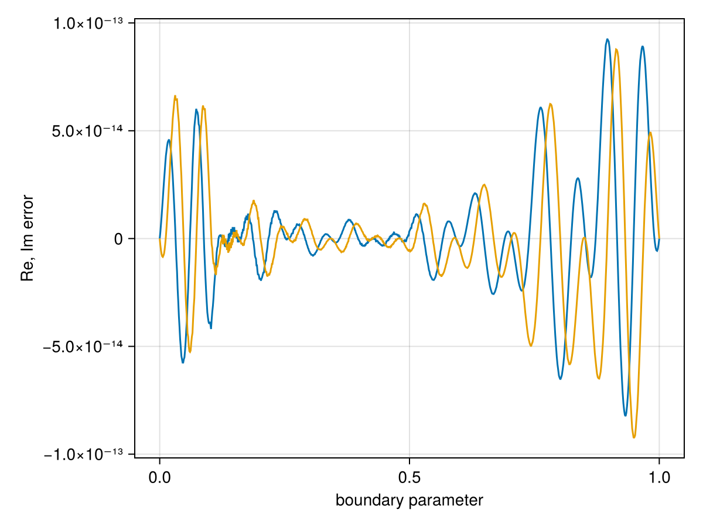
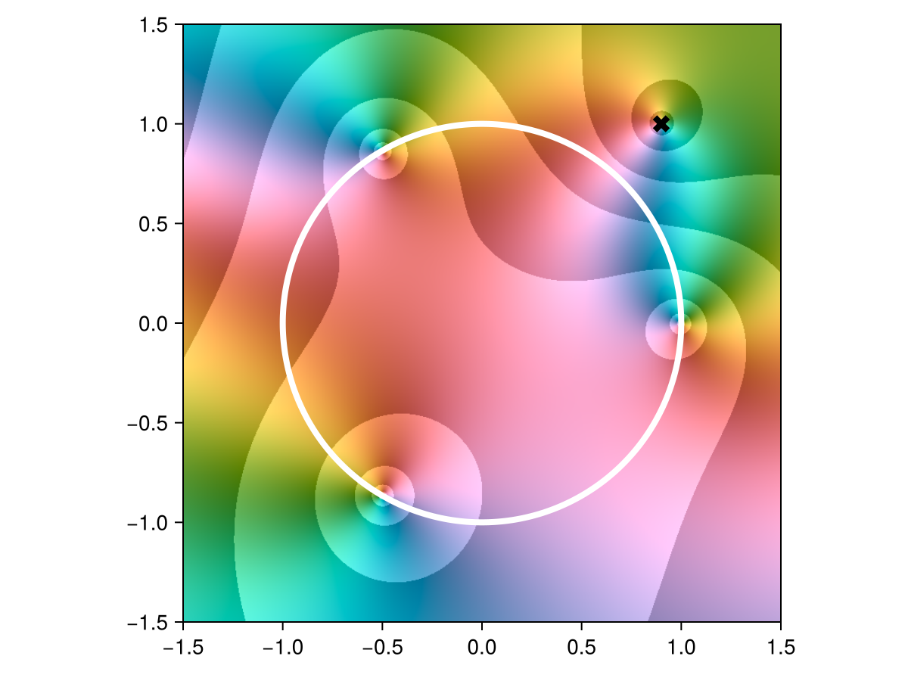
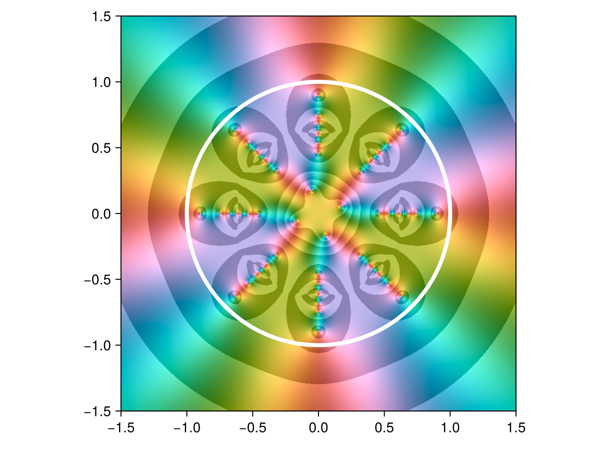
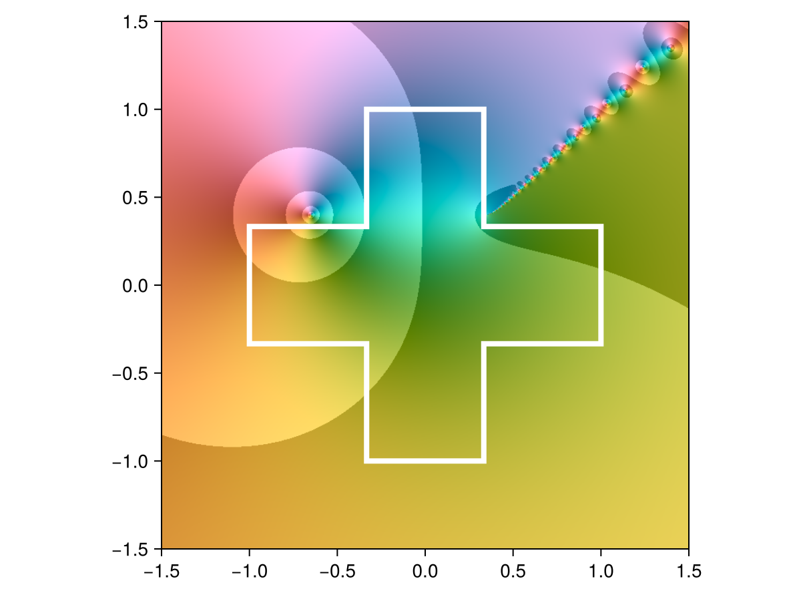
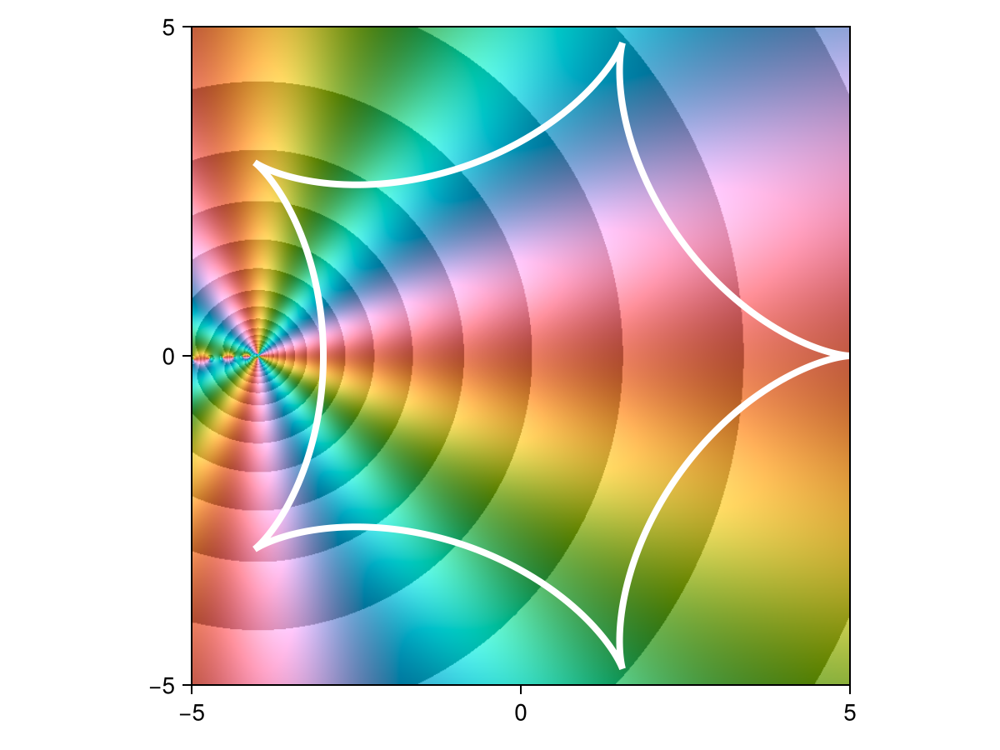
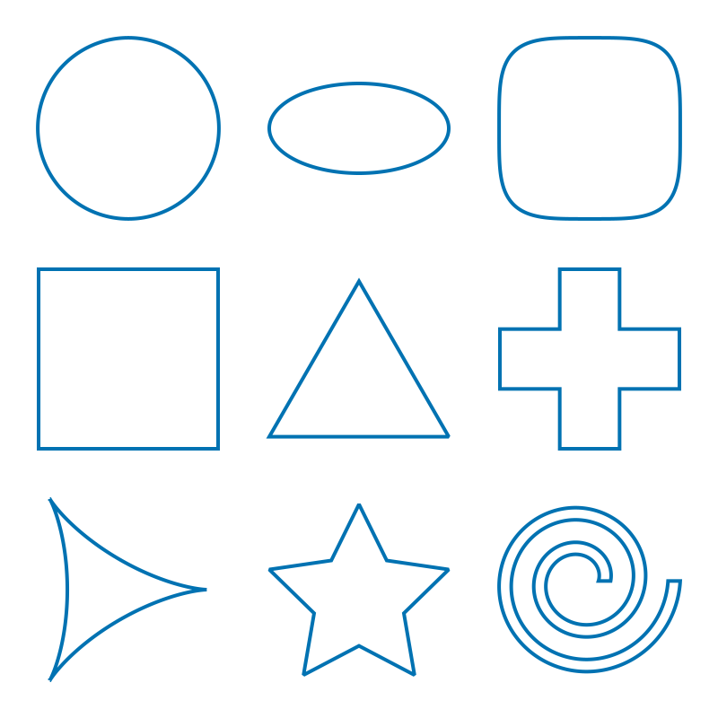
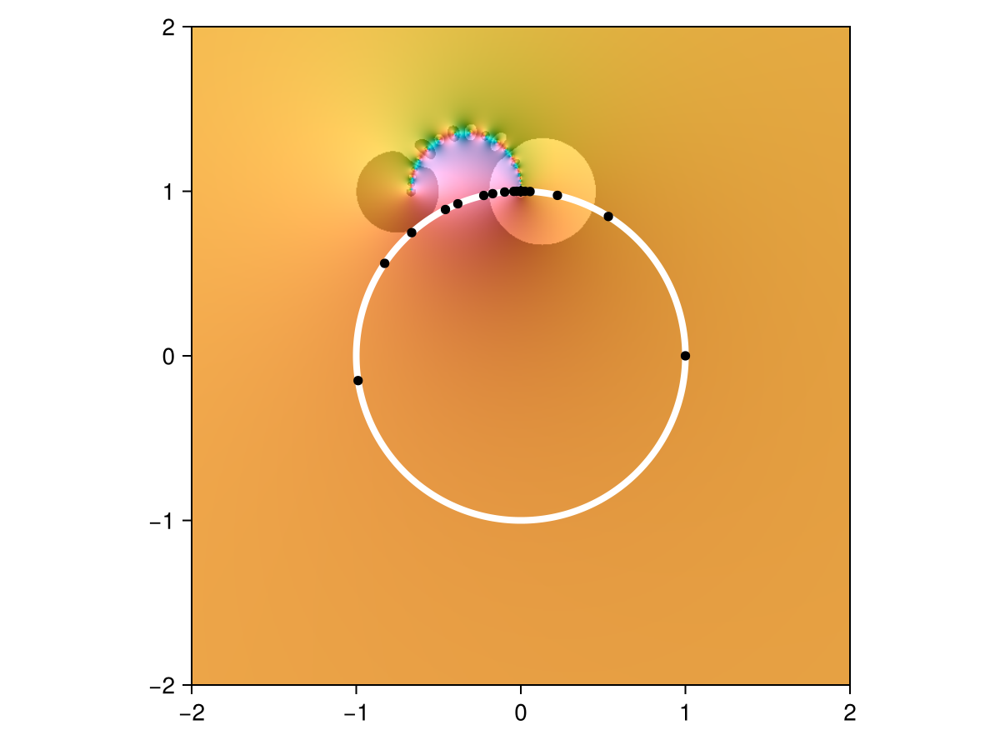
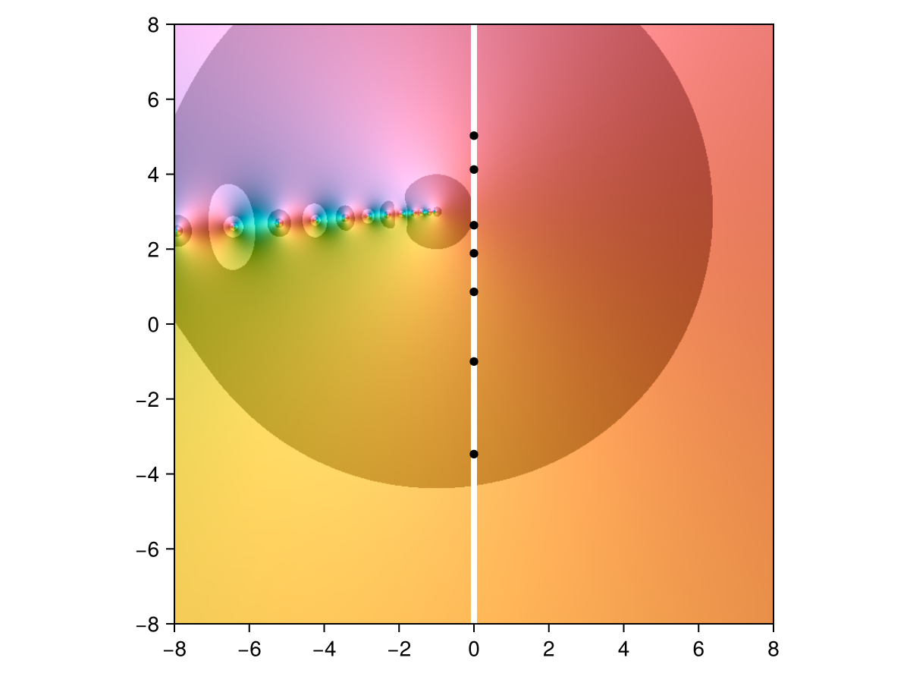

# Approximation on domains {#Approximation-on-domains}

Rational approximations can be found on domains other than intervals using the [`ComplexRegions`](https://complexvariables.github.io/ComplexRegions.jl/stable/) package.

## Unit circle and disk {#Unit-circle-and-disk}

The domain `unit_circle` is predefined. Here&#39;s a function approximated on the unit circle:

```julia
using RationalFunctionApproximation, CairoMakie, DomainColoring
const shg = current_figure

f = z -> (z^3 - 1) / sin(z - 0.9 - 1im)
r = approximate(f, unit_circle)
```


```
Barycentric{Float64, ComplexF64} rational interpolant of type (9, 9) on the domain: Circle(0.0+0.0im,1.0,ccw)
```


This approximation is accurate to 13 digits, as we can see by plotting the error around the circle:

```julia
errorplot(r)
```

{width=600px height=450px}

Here is how the approximation looks in the complex plane (using a black cross to mark the pole):

```julia
using ComplexRegions, ComplexPlots
domaincolor(r, [-1.5, 1.5, -1.5, 1.5], abs=true)
lines!(unit_circle, color=:white, linewidth=4)
scatter!(poles(r), markersize=16, color=:black, marker=:xcross)
limits!(-1.5, 1.5, -1.5, 1.5)
shg()
```

{width=600px height=450px}

Above, you can also see the zeros at roots of unity.

This next function has infinitely many poles and an essential singularity inside the unit disk:

```julia
f = z -> tan(1 / z^4)
r = approximate(f, unit_circle)
domaincolor(r, [-1.5, 1.5, -1.5, 1.5], abs=true)
lines!(unit_circle, color=:white, linewidth=4)
shg()
```

{width=600px height=450px}

We can request an approximation that is analytic in a region. In this case, it would not make sense to request one on the unit disk, since the singularities are necessary:

```julia
r = approximate(f, unit_disk)
```


```
Barycentric{Float64, ComplexF64} rational interpolant of type (0, 0) on the domain: Region interior to Circle(0.0+0.0im,1.0,ccw)
```


In the result above, the approximation is simply a constant function, as the algorithm could do no better. However, if we request analyticity in the region exterior to the circle, everything works out:

```julia
r = approximate(f, exterior(unit_circle))
max_err = maximum(abs, check(r, quiet=true)[2])
println("Max error: ", max_err)
```


```
Max error: 1.105722495444769e-13
```


## Other shapes {#Other-shapes}

We are not limited to intervals and circles! There are other shapes available in `ComplexRegions.Shapes`:

```julia
import ComplexRegions.Shapes
r = approximate(z -> log(0.35 + 0.4im - z), interior(Shapes.cross))
domaincolor(r, [-1.5, 1.5, -1.5, 1.5], abs=true)
lines!(boundary(r.domain), color=:white, linewidth=4)
shg()
```

{width=600px height=450px}

```julia
c = Shapes.hypo(5)
r = approximate(z -> (z+4)^(-3.5), interior(c))
domaincolor(r, [-5, 5, -5, 5], abs=true)
lines!(c, color=:white, linewidth=4)
shg()
```

{width=600px height=450px}

Here are the predefined shapes:

```julia
shapes = [
    Shapes.circle  Shapes.ellipse(2, 1) Shapes.squircle;
    Shapes.square  Shapes.triangle      Shapes.cross;
    Shapes.hypo(3) Shapes.star          Shapes.spiral(2, 0.7)
    ]

fig = Figure(size=(400, 400))
for i in 1:3, j in 1:3
    ax, _ = lines(fig[i, j], shapes[i, j], linewidth=2, axis=(autolimitaspect=1,))
    hidedecorations!(ax); hidespines!(ax)
end
resize_to_layout!(fig)
shg()
```

{width=400px height=400px}

## Unbounded domains {#Unbounded-domains}

It&#39;s also possible to approximate on domains with an unbounded boundary curve, but this capability is not yet automated. For example, the function

```julia
f = z -> 1 / sqrt(z - (-1 + 3im))
```


```
#9 (generic function with 1 method)
```


is analytic on the right half of the complex plane. In order to produce an approximation on that domain, we can transplant it to the unit disk via a Möbius transformation $\phi$:

```julia
z = cispi.(range(-1, 1, length=90))           # points on the unit circle
φ = Mobius( [-1, -1im, 1], [1im, 0, -1im])    # unit circle ↦ imag axis
extrema(real, φ.(z))
```


```
(-1.1158266984625186e-14, 3.135304997405465e-13)
```


By composing $f$ with $\phi$, we can approximate within the disk while $f$ is evaluated only on its native domain:

```julia
r = approximate(f ∘ φ, interior(unit_circle))
domaincolor(r, [-2, 2, -2, 2], abs=true)
lines!(unit_circle, color=:white, linewidth=4)
scatter!(nodes(r.fun), color=:black, markersize=8)
shg()
```

{width=600px height=450px}

Above, the black markers show the nodes of the interpolant. We can view the same approximation within the right half-plane by composing $r$ with $\phi^{-1}$:

```julia
φ⁻¹ = inv(φ)
domaincolor(r ∘ φ⁻¹, [-8, 8, -8, 8], abs=true)
lines!([(0, 8), (0, -8)], color=:white, linewidth=4)
scatter!(φ.(nodes(r.fun)), color=:black, markersize=8)
limits!(-8, 8, -8, 8)
shg()
```

{width=600px height=450px}
