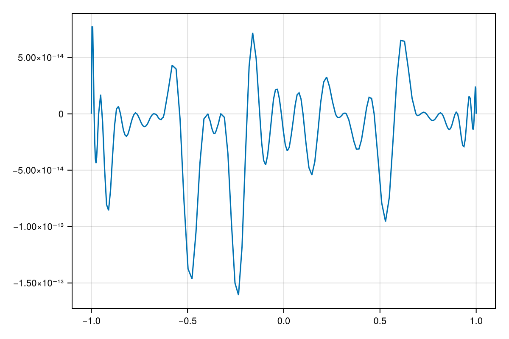
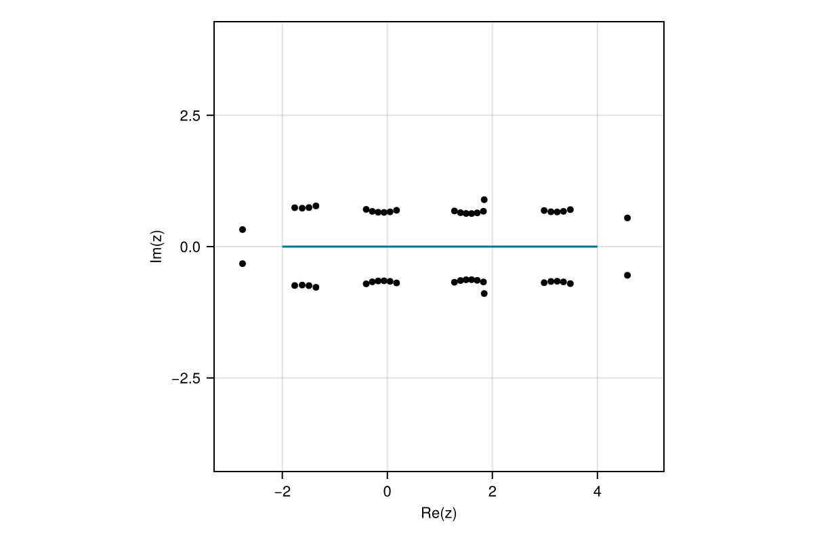
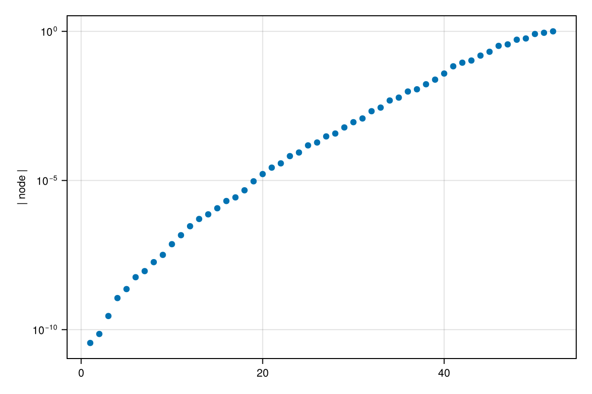

# Rational function approximation in Julia {#Rational-function-approximation-in-Julia}

_Documentation for [RationalFunctionApproximation.jl](https://github.com/complexvariables/RationalFunctionApproximation.jl)._

This package computes rational approximations of a function or data given in the complex plane. For background reading, see [[1](/index#NakatsukasaAAAAlgorithm2018)], [[2](/index#DriscollAAARational2024a)] (or the related arXiv version [[3](/index#DriscollAAARational2023a)]), [[4](/index#CostaAAAleastSquares2023)], and [[5](/index#CelisNumericalContinued2024)].

A rational function is a ratio of two polynomials. Rational functions are capable of very high accuracy and, unlike polynomial interpolation, do not require the interpolation nodes to be distributed in a highly restricted way. They are a good choice for approximating functions with singularities or other complicated behavior. Also unlike polynomials, however, they do not depend linearly on the data, which has historically made them difficult to compute and work with.

Here&#39;s a smooth, gentle function on the interval $[-1, 1]$:

```julia
using RationalFunctionApproximation, CairoMakie
CairoMakie.update_theme!(size = (600, 400), fontsize=11)
const shg = current_figure

f = x -> exp(cos(4x) - sin(3x))
lines(-1..1, f)
```

{width=600px height=400px}

To create a rational function that approximates $f$ well on this domain, we make a call to the `approximate` function:

```julia
r = approximate(f, unit_interval)
```


```
Barycentric{Float64, Float64} rational interpolant of type (19, 19) on the domain: Segment(-1.0,1.0)
```


The value of `unit_interval` is defined by the package to be the interval $[-1, 1]$. The result `r` is a type (19,19) rational approximant that can be evaluated like a function:

```julia
f(0.5) - r(0.5)
```


```
-6.186717804723685e-14
```


We see that this approximation is accurate to about 13 places over the interval:

```julia
z, err = check(r)
lines(z, err)
```

{width=600px height=400px}

The rational approximant interpolates $f$ at nodes that were selected iteratively to represent the function well.

```julia
x = nodes(r)
scatter!(x, 0*x, markersize = 8, color=:black)
shg()
```

{width=600px height=400px}

We could choose to approximate over a wider interval:

```julia
using ComplexRegions
r = approximate(f, Segment(-2, 4))
```


```
Barycentric{Float64, Float64} rational interpolant of type (48, 48) on the domain: Segment(-2.0,4.0)
```


Note that the degree of the rational function increased to capture the additional complexity.

One interesting feature of a rational function is that it can have poles, or infinite value, at the roots of the denominator polynomial. In this case, the poles hint at where the function is most sharply peaked:

```julia
poleplot(r)
```

{width=600px height=400px}

More typically, however, a function that is well-behaved on the real axis has a singularity structure lurking in the complex plane, and the poles of rational functions provide a unique way to cope with them. For instance, let&#39;s try approximating the hyperbolic secant function:

```julia
r = approximate(sech, Segment(-4, 4))
```


```
Barycentric{Float64, Float64} rational interpolant of type (10, 10) on the domain: Segment(-4.0,4.0)
```


The sech function is smooth on the real axis but has poles on the imaginary axis at odd multiples of $i\pi/2$. The rational approximant automatically locates the poles closest to the domain:

```julia
2 * poles(r) / π
```


```
10-element Vector{ComplexF64}:
    -0.8480537748956253 - 6.958993464534257im
    -0.8480537748956252 + 6.958993464534257im
  -3.800037215431165e-8 - 3.000001474874752im
 -3.8000372154311644e-8 + 3.000001474874753im
 2.9914864491704326e-13 - 0.9999999999989461im
 2.9914864491704326e-13 + 0.9999999999989458im
   3.571865550474971e-5 - 4.993621060758388im
   3.571865550474971e-5 + 4.993621060758388im
     0.8489644277744672 - 6.96037317612887im
     0.8489644277744672 + 6.960373176128869im
```


We can use the [DomainColoring](https://eprovst.github.io/DomainColoring.jl/stable/) package to visualize the rational function in the complex plane. Color is used to show the phase angle of the value, while dark-to-bright cycles of lightness show powers of e in the magnitude. The poles stand out as locations of rapid change in both phase and magnitude.

```julia
using DomainColoring

domaincolor(r, [-6, 6, -6, 6]; abs=true)
lines!(r.domain, linewidth=3, color=:white)
shg()
```

{width=600px height=400px}

A meromorphic function such as sech has only those isolated poles as singularities, and getting those right is most of the battle. By contrast, the function $\log(x + 0.05i)$ has a branch point at $x = -0.05i$ necessitating a branch cut connecting it to infinity. A rational approximant uses poles to construct a proxy branch cut:

```julia
f = x -> log(x + 0.05im)
r = approximate(f, unit_interval)
domaincolor(r, [-1.2, 1.2, -1.2, 1.2]; abs=true)
lines!(r.domain, linewidth=3, color=:white)
shg()
```

{width=600px height=400px}

We close with a function having a singularity that lies on the interval: $|x|$. A famous result of Newman in 1964 proved that the best rational approximation of degree $n$ has root-exponential convergence.

```julia
r = approximate(abs, unit_interval; tol=1e-12)
convergenceplot(r)
```

{width=600px height=400px}

(The errors increase for odd degrees above because they are being measured at the test points discovered at the end of the iteration, not the ones during the iteration.) We find that the nodes of the approximant are also distributed (nearly) root-exponentially around the singularity:

```julia
z = filter(>(0), nodes(r))
scatter(sort(abs.(z)), axis=(ylabel="| node |", yscale=log10,))
```

{width=600px height=400px}

## Contents {#Contents}
- [Algorithms](/algorithms#Algorithms) describes the algorithms available for rational approximation.
  
- [Approximation on domains](/domains#Approximation-on-domains) shows how to approximate functions on different domains.
  
- [Discrete data](/discrete#Discrete-data) shows how to approximate data given as points and values rather than as functions.
  
- [Minimax approximation](/minimax#Minimax-approximation) explains the difference between the default approximation and minimax approximation.
  
- [Usage from Python](/python#Usage-from-Python) shows how to use the package from Python.
  
- [Functions and types](/functions#Functions-and-types) collects the documentation strings of the major package features.
  

## References {#References}
1. <a id='NakatsukasaAAAAlgorithm2018'></a>
  Y. Nakatsukasa, O. Sète and L. N. Trefethen. _The AAA Algorithm for Rational Approximation_. [SIAM Journal on Scientific Computing **40**, A1494-A1522](https://doi.org/10.1137/16m1106122) (2018). Accessed on Jul 14, 2020.
  
2. <a id='DriscollAAARational2024a'></a>
  T. A. Driscoll, Y. Nakatsukasa and L. N. Trefethen. _AAA Rational Approximation on a Continuum_. [SIAM Journal on Scientific Computing **46**, A929-A952](https://doi.org/10.1137/23M1570508) (2024). Accessed on May 15, 2025.
  
3. <a id='DriscollAAARational2023a'></a>
  T. Driscoll, Y. Nakatsukasa and L. N. Trefethen. [_AAA Rational Approximation on a Continuum_](https://doi.org/10.48550/ARXIV.2305.03677) (2023). Accessed on Feb 26, 2024.
  
4. <a id='CostaAAAleastSquares2023'></a>
  S. Costa and L. N. Trefethen. [_AAA-least Squares Rational Approximation and Solution of Laplace Problems_](https://doi.org/10.4171/8ecm/16). In: _European Congress of Mathematics_, 1 Edition, edited by A. Hujdurović, K. Kutnar, D. Marušič, Š. Miklavič, T. Pisanski and P. Šparl (EMS Press, 2023); pp. 511–534. Accessed on Oct 5, 2023.
  
5. <a id='CelisNumericalContinued2024'></a>
  O. S. Celis. _Numerical Continued Fraction Interpolation_. [Ukrainian Mathematical Journal **76**, 635–648](https://doi.org/10.1007/s11253-024-02344-5) (2024). Accessed on Jan 28, 2025.
  
