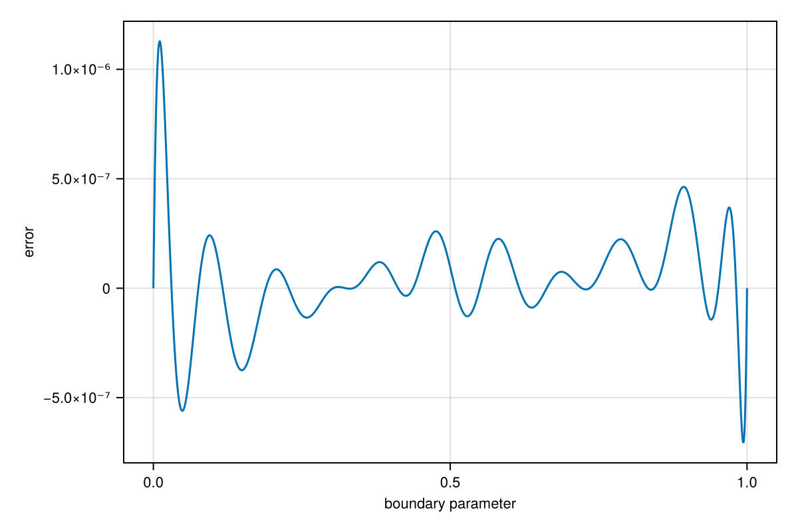
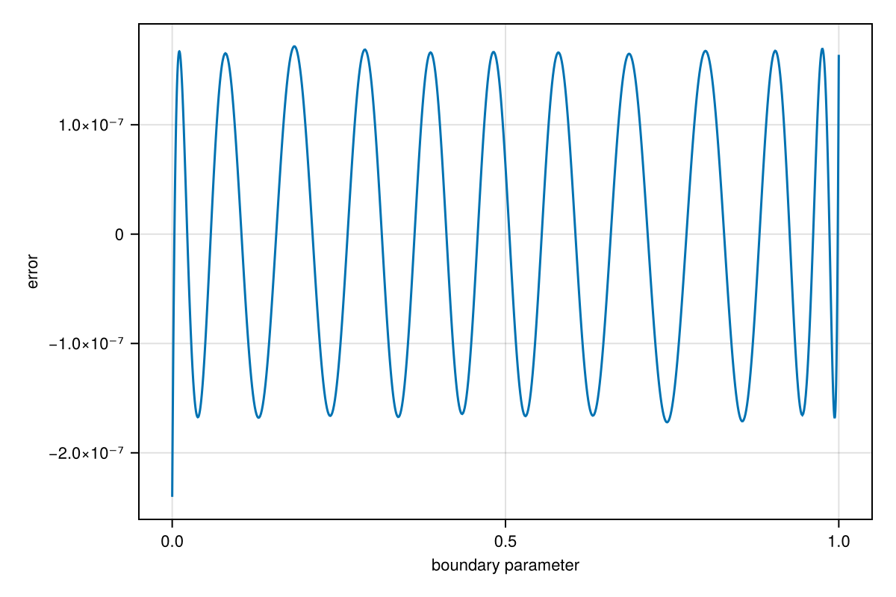
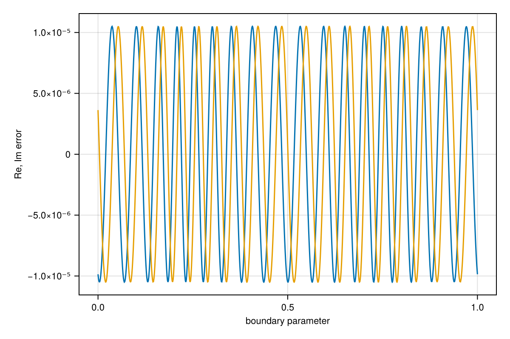

# Minimax approximation {#Minimax-approximation}

The `approximate` function minimizes approximation error in a discrete least-squares sense. By following up with an iteratively reweighted least-squares (IRLS) approach initially due to Lawson, we can approach the classical problem of optimization in the infinity- or max-norm sense instead.

For example, suppose we limit the degree of a rational interpolant of a smooth function:

```julia
using RationalFunctionApproximation, CairoMakie
const shg = current_figure
f = x -> exp(cos(4x) - sin(3x))
r = approximate(f, unit_interval, max_iter=12)
```


```
Barycentric{Float64, Float64} rational interpolant of type (11, 11) on the domain: Segment(-1.0,1.0)
```


The error varies a lot in amplitude over the interval:

```julia
errorplot(r)
```

{width=600px height=400px}

Now we apply 20 Lawson iterations to refine the approximation and approach the minimax ideal:

```julia
r = minimax(r, 20)
errorplot(r)
```

{width=600px height=400px}

As you can see above, the error is now nearly equioscillatory over the interval. Moreover, the interpolation nodes appear to have shifted to resemble Chebyshev points of the first kind. If we try minimax approximation on the unit circle, however, equioscillation tends to lead to equally spaced nodes:

```julia
f = z -> cos(4z) - sin(3z)
r = approximate(f, unit_circle, max_iter=10)
r = minimax(r, 20)
errorplot(r, use_abs=false)
```

{width=600px height=400px}
