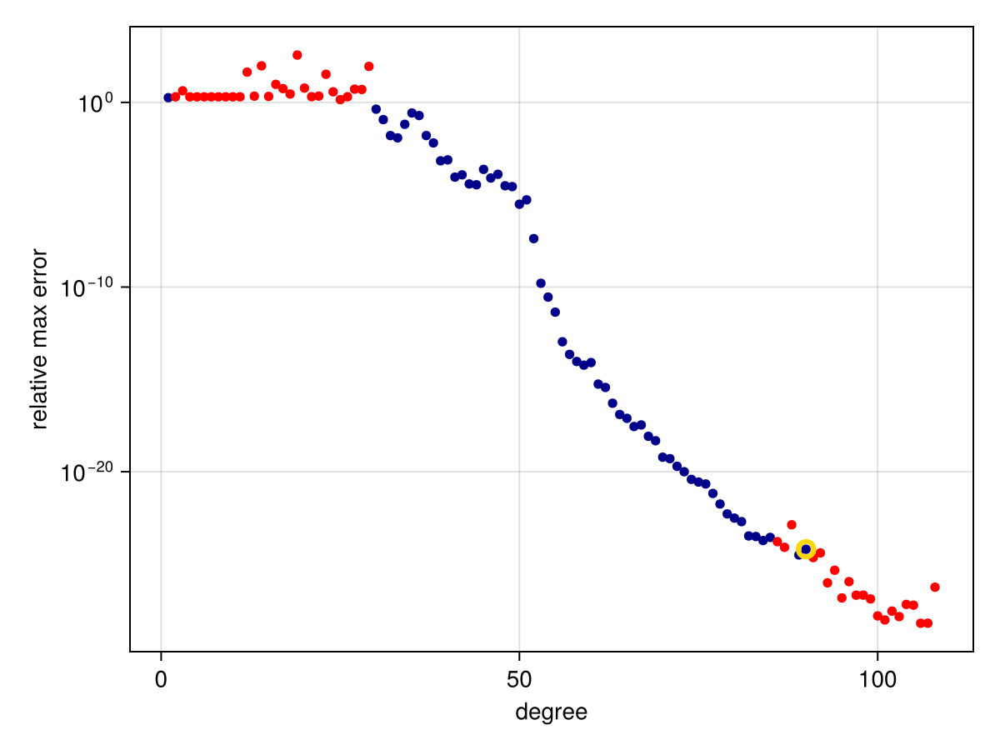

# Algorithms {#Algorithms}

```julia
using RationalFunctionApproximation, CairoMakie
```


There are three algorithms for rational approximation offered in this version of the package. 

## AAA {#AAA}

The most robust method is the [continuum variant of the AAA algorithm](https://doi.org/10.1137/23M1570508) (see also the [arXiv version](https://arxiv.org/abs/2305.03677)). Briefly speaking, the AAA algorithm maintains a set of interpolation nodes and a set of test points on the boundary of the domain. The node set is grown iteratively by finding the best current approximation in a least-squares sense on the test nodes, then greedily adding the worst-case test point to the node set.

The `convergenceplot` function shows the errors of the approximants found during the AAA iteration.

```julia
f = x -> cos(11x)
r = approximate(f, unit_interval)
convergenceplot(r)
```

{width=600px height=450px}

(The plots in this documentation are made using `CairoMakie`, but the same functions are made available for `Plots`.)  In the plot above, the markers show the estimated max-norm error of the AAA rational interpolant over the domain as a function of the iteration counter. Each iteration adds one degree to both the numerator and denominator of the rational approximation. The gold halo indicates the final approximation chosen by the algorithm. The red dots indicate that a pole of the rational interpolant lies in the approximation domain. We can verify this fact by using `rewind` to recover the approximation from iteration 7:

```julia
julia> r7 = rewind(r, 7)
Barycentric{Float64, Float64} rational interpolant of type (7, 7) on the domain: Segment(-1.0,1.0)

julia> poles(r7)
7-element Vector{ComplexF64}:
   -0.562276305067548 + 0.0im
 -0.13931464700499005 - 0.5671734528096023im
 -0.13931464700499002 + 0.5671734528096023im
  0.27744567832654693 - 0.4114727572801402im
  0.27744567832654693 + 0.4114727572801403im
   0.7500675154941951 - 0.37856507542419615im
   0.7500675154941951 + 0.3785650754241962im
```


In most cases, the poles move out of the approximation domain as the iteration proceeds to better accuracy. However, it is possible for the iteration to stagnate if the original function has a singularity very close to the domain.

```julia
f = x -> tanh(3000*(x - 1//4))
r = approximate(f, unit_interval)
convergenceplot(r)
```

{width=600px height=450px}

This effect is thought to be mainly due to roundoff and conditioning of the problem. In this case, if we use more accurate floating-point arithmetic, we can see that the AAA convergence continues steadily past the previous plateau. In the following, we apply `Double64` arithmetic, having used exact rational numbers already in the definition of `f`:

```julia
using DoubleFloats, ComplexRegions
r = approximate(f, Segment{Double64}(-1, 1))
convergenceplot(r)
```

{width=600px height=450px}

In the extreme case of a function with a singularity on the domain, the convergence can be substantially affected:

```julia
f = x -> abs(x - 1/8)
r = approximate(f, unit_interval)
convergenceplot(r)
```

{width=600px height=450px}

In such a case, we might get improvement by increasing the number of allowed consecutive failures via the `stagnation` keyword argument:

```julia
r = approximate(f, unit_interval, stagnation=50)
convergenceplot(r)
```

{width=600px height=450px}

## Prescribed poles {#Prescribed-poles}

While finding a rational interpolant is a nonlinear problem, we can compute a linear variant if we prescribe the poles of the rational function. Specifically, given the poles $\zeta_1,\ldots, \zeta_n$, we can find a polynomial $p$ and residues $w_k$ such that

$$f(z) \approx p(z) + \sum_{k=1}^n \frac{w_k}{z - \zeta_k}. $$

When posed on a discrete set of test points, this is a linear least-squares problem. In order to represent the polynomial stably, an Arnoldi iteration is used to find a well-conditioned basis for the test points. 

There is no iteration on the degree of the polynomial or rational parts of the approximant. Instead, the discretization of the boundary of the domain is refined iteratively until either the max-norm error is below a specified threshold or has stopped improving.

```julia
f = x -> tanh(x)
ζ = 1im * π * [-1/2, 1/2, -3/2, 3/2]
r = approximate(f, Segment(-2, 2), ζ)
```


```
PartialFractions{Float64, ComplexF64} rational interpolant of type (6, 4) on the domain: Segment(-2.0,2.0)
```


```julia
max_err(r) = println("Max error: ", maximum(abs, check(r, quiet=true)[2]))
max_err(r);
```


```
Max error: 0.0004073193339498571
```


To get greater accuracy, we can increase the degree of the polynomial part.

```julia
r = approximate(f, Segment(-2, 2), ζ; degree=20)
max_err(r);
```


```
Max error: 1.3766991770584028e-14
```


Note that the residues (in the exact function, all equal to one) may be accurate at the poles closest to the domain, but much less so elsewhere.

```julia
Pair.(residues(r)...)
```


```
4-element Vector{Pair{ComplexF64, ComplexF64}}:
 -0.0 - 1.5707963267948966im => 1.0000000045406159 - 2.329159134461935e-10im
  0.0 + 1.5707963267948966im => 1.000000004540616 + 2.3291594838573823e-10im
   -0.0 - 4.71238898038469im => 0.009603454762044177 + 3.538686787250171e-11im
    0.0 + 4.71238898038469im => 0.009603454762044153 - 3.5386868696413124e-11im
```


Suppose now we approximate $|x|$ using AAA. We can extract the poles of the result.

```julia
r = approximate(abs, unit_interval, tol=1e-9)
ζ = poles(r)
```


```
60-element Vector{ComplexF64}:
 -0.0008101058194005839 - 0.08016719360490714im
 -0.0008101058194005839 + 0.08016719360490714im
 -0.0007375114540379453 + 0.1269603270423085im
 -0.0007375114540379452 - 0.1269603270423085im
 -0.0006245843914514905 - 0.05020438555650425im
 -0.0006245843914514904 + 0.05020438555650426im
 -0.0003610706603351521 + 0.031134561561803734im
  -0.000361070660335152 - 0.031134561561803737im
 -0.0002782988614695636 - 0.2000671852591134im
 -0.0002782988614695636 + 0.20006718525911335im
                        ⋮
  0.0005381186802786164 + 0.3154366648694459im
  0.0015151838203034524 - 0.5027532119121074im
  0.0015151838203034526 + 0.5027532119121075im
   0.002335056797787523 - 0.8320576643423339im
   0.002335056797787523 + 0.8320576643423341im
  0.0027412710136418862 - 1.5543249701223445im
  0.0027412710136418862 + 1.5543249701223445im
   0.002815805062567875 - 4.939842877337736im
   0.002815805062567875 + 4.939842877337736im
```


To what extent might these poles be suitable for a different function that has the same singularity?

```julia
s = approximate(x -> exp(abs(x)), unit_interval, ζ; tol=1e-8, degree=20)
max_err(r);
```


```
Max error: 4.216500066740088e-9
```


## Thiele continued fractions (experimental) {#Thiele-continued-fractions-experimental}

The AAA algorithm is remarkably robust, but a potential downside is that constructing an approximant of degree $n$ requires an SVD that takes $O(n^3)$ time. Thus, for an iteration up to degree $n$, the work is $O(n^4)$. In many cases, the value of $n$ is small enough not to cause a concern, but there is some motivation to find a more efficient algorithm.

One possibility is to use a continued fraction representation of the rational approximant. The Thiele representation, dating back to the 1800s, uses inverse divided differences to represent a rational interpolant, requiring just $O(n)$ time to add a node to an approximation of degree $n$. Divided differences are notoriously unstable, but [work by Salazar in 2024](https://doi.org/10.1007/s11253-024-02344-5) (or [the arXiv version](http://arxiv.org/abs/2109.10529)) indicates that a greedy adaptive approach can reduce or eliminate the instability.  

To try greedy Thiele, use `method=Thiele` as an argument to `approximate`. 

```julia
f = x -> cos(11x - 5)
r = approximate(f, unit_interval; method=Thiele)
convergenceplot(r)
```

{width=600px height=450px}

Some common functions give an error due to a division by zero that is not mathematically important. Until a mechanism is implemented to handle this situation more gracefully, you can usually circumvent this problem by adding a term that breaks some symmetry.

```julia
f = x -> cos(11x)
try
    r = approximate(f, unit_interval; method=Thiele)
catch err
    println("Caught the error '$(err.msg)'")
end
```


```
┌ Warning: Assignment to `r` in soft scope is ambiguous because a global variable by the same name exists: `r` will be treated as a new local. Disambiguate by using `local r` to suppress this warning or `global r` to assign to the existing global variable.
└ @ algorithms.md:128
Caught the error 'Infinite inverse difference. Try breaking symmetry of the function.'
```


```julia
f = x -> x + cos(11x)
r = approximate(f, unit_interval; method=Thiele)
max_err(r);
```


```
Max error: 4.2932324362254803e-13
```

